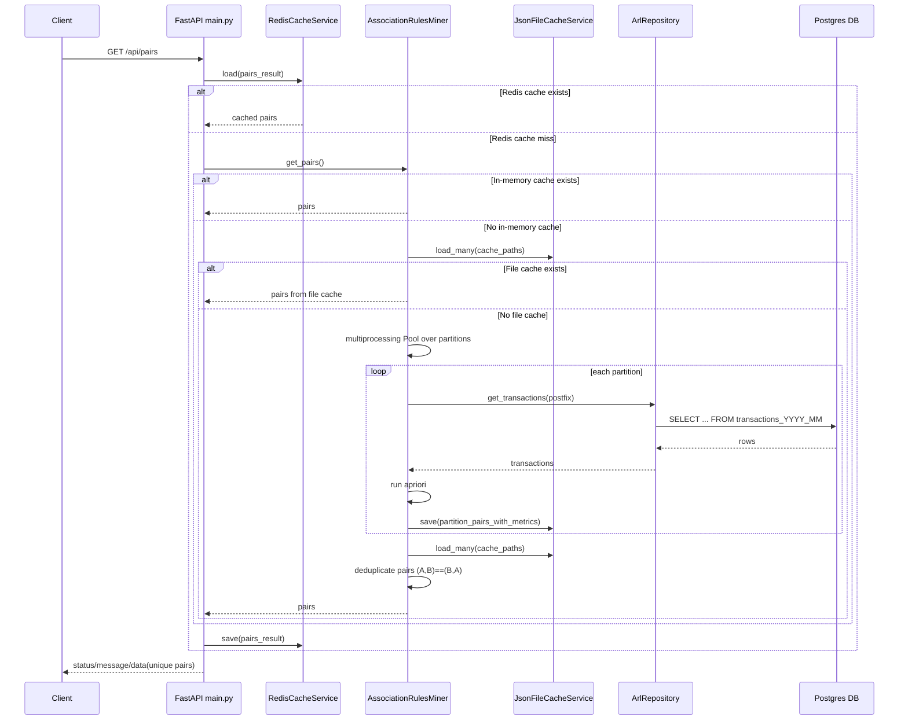
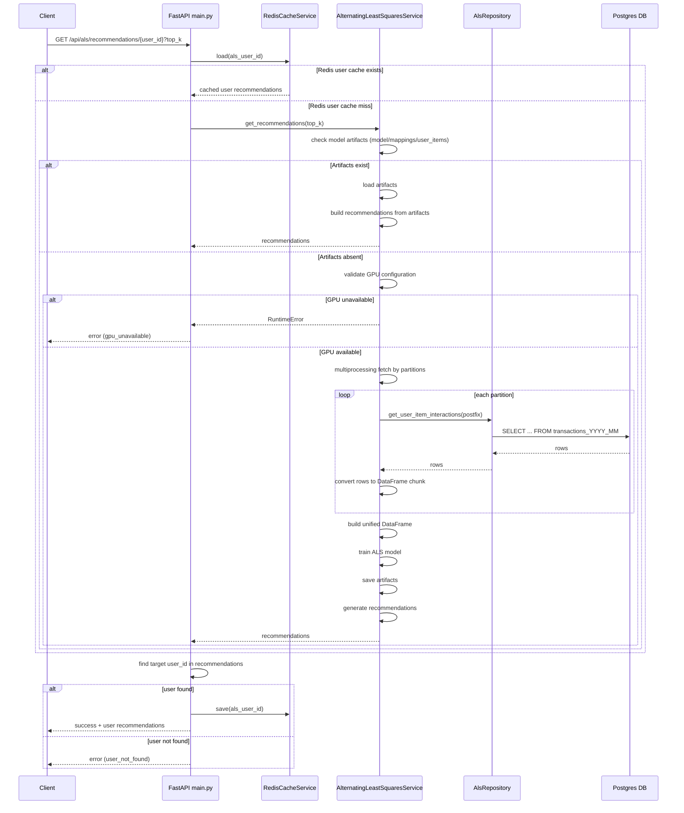
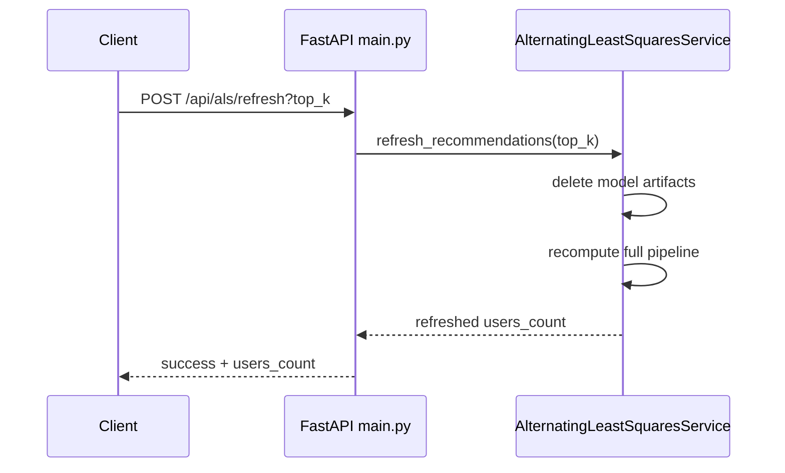
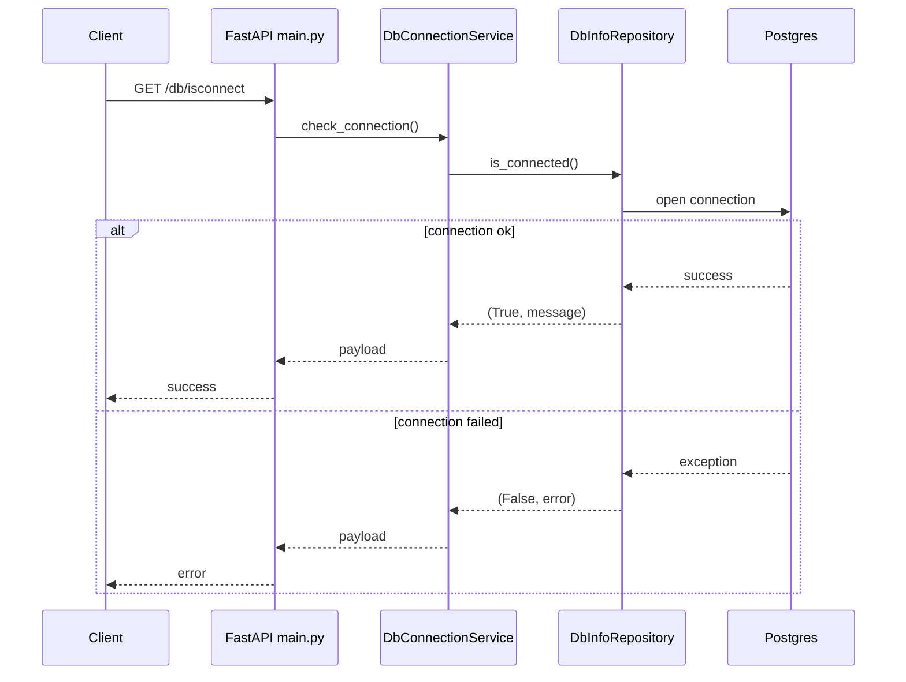

# API Diagrams

## 1) API Route Map

```mermaid
flowchart TD
    A[Client] --> B[GET /]
    A --> C[GET /api/pairs]
    A --> D[GET /api/pairs/{product_id}]
    A --> E[GET /api/als/recommendations/{user_id}?top_k=12]
    A --> F[POST /api/als/refresh?top_k=12]
    A --> G[GET /db/isconnect]

    C -. read transactions .-> P[(Postgres)]
    D -. read transactions .-> P
    E -. read interactions on cache miss .-> P
    F -. force full rebuild from DB .-> P
    G --> P
```

## 2) Sequence: /api/pairs



## 3) Sequence: /api/als/recommendations/{user_id}



## 4) Sequence: /api/als/refresh



## 5) Sequence: /db/isconnect


